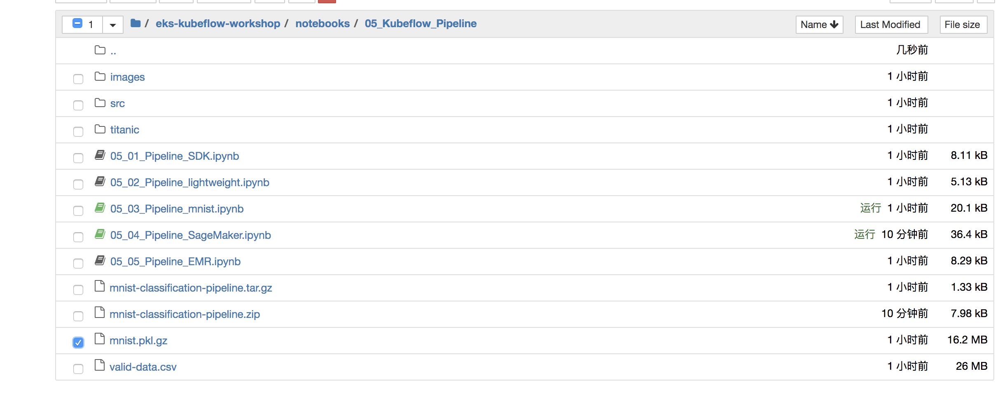

### Kubeflow Pipelines与sagemaker集成

Kubeflow pipeline是工具包的核心组件之一，在安装Kubeflow时自动部署。Kubeflow管道包括:

- 用于管理和跟踪实验、作业和运行的用户界面(UI)
- 用于调度多步ML工作流的引擎
- 用于定义和操作管道和组件的SDK
- 使用SDK与笔记本交互

Kubeflow pipeline SDK提供了一组Python包，您可以使用它们来指定和运行您的机器学习(ML)工作流。pipeline是ML工作流的描述，包括组成工作流步骤的所有组件以及组件之间如何交互。

#### 在 EKS cluster配置 AWS credentials 

为了运行本实验，我们需要不同级别的IAM权限。

1. 使用Sagemaker策略创建Kubernetes secrets aws-secret。我们将在管道执行期间使用它来调用AWS API。
2. 为Sagemaker创建一个IAM执行角色，以便作业可以承担此角色以执行Sagemaker操作。

通常在生产环境中，您将根据操作分配细粒度的权限，并利用诸如IAM Role for Service Account这样的工具来确保对AWS资源的访问，但为简单起见，我们将为分配AmazonSageMakerFullAccess IAM策略。

在终端运行下列命令创建 IAM 权限：

```bash
aws iam create-user --user-name sagemakeruser
aws iam attach-user-policy --user-name sagemakeruser --policy-arn arn:aws:iam::aws:policy/AmazonSageMakerFullAccess
aws iam create-access-key --user-name sagemakeruser > /tmp/create_output.json
```

设置环境变量：

```bash
export AWS_ACCESS_KEY_ID_VALUE=$(jq -j .AccessKey.AccessKeyId /tmp/create_output.json | base64)
export AWS_SECRET_ACCESS_KEY_VALUE=$(jq -j .AccessKey.SecretAccessKey /tmp/create_output.json | base64)
```

 在EKS cluster中创建secret资源:

```yaml
cat <<EOF | kubectl apply -f -
apiVersion: v1
kind: Secret
metadata:
  name: aws-secret
  namespace: kubeflow
type: Opaque
data:
  AWS_ACCESS_KEY_ID: $AWS_ACCESS_KEY_ID_VALUE
  AWS_SECRET_ACCESS_KEY: $AWS_SECRET_ACCESS_KEY_VALUE
EOF
```

运行下列命令创建 Sagemaker执行角色

```bash
TRUST="{ \"Version\": \"2012-10-17\", \"Statement\": [ { \"Effect\": \"Allow\", \"Principal\": { \"Service\": \"sagemaker.amazonaws.com\" }, \"Action\": \"sts:AssumeRole\" } ] }"
aws iam create-role --role-name eksworkshop-sagemaker-kfp-role --assume-role-policy-document "$TRUST"
aws iam attach-role-policy --role-name eksworkshop-sagemaker-kfp-role --policy-arn arn:aws:iam::aws:policy/AmazonSageMakerFullAccess
aws iam attach-role-policy --role-name eksworkshop-sagemaker-kfp-role --policy-arn arn:aws:iam::aws:policy/AmazonS3FullAccess
aws iam get-role --role-name eksworkshop-sagemaker-kfp-role --output text --query 'Role.Arn'
```

在脚本的最后，您将得到生成的IAM角色的arn。请记录这个角色arn，因为在kubeflow管道创建步骤中需要，下面是输出的例子：

```bash
$ aws iam get-role --role-name eksworkshop-sagemaker-kfp-role --output text --query 'Role.Arn'
arn:aws:iam::371348455981:role/eksworkshop-sagemaker-kfp-role
```

最后,分配 sagemaker:InvokeEndpoint 权限给 EKS 工作节点IAM role

```bash
cat <<EoF > ~/environment/sagemaker-invoke.json
{
    "Version": "2012-10-17",
    "Statement": [
        {
            "Effect": "Allow",
            "Action": [
                "sagemaker:InvokeEndpoint"
            ],
            "Resource": "*"
        }
    ]
}
EoF
aws iam put-role-policy --role-name $ROLE_NAME --policy-name sagemaker-invoke-for-worker --policy-document file://~/environment/sagemaker-invoke.json
```

#### 运行 Sagemaker pipeline 笔记本

 浏览到Sagemaker pipeline notebook (eks-workshop-notebook/notebooks/05_Kubeflow_Pipeline/05_04_Pipeline_SageMaker.ipynb). 打开 Sagemaker pipeline 笔记本


完成以下先决条件:

创建S3存储桶；复制管道数据。您可以跳过步骤3，因为我们已经在前面创建了Kubernetes secrets和Sagemaker执行角色，跳过3。继续执行第4步，安装Kubeflow管道SDK。

完成所有先决条件步骤之后，继续构建pipeline。首先运行步骤1来加载Kubeflow管道SDK，完成之后，运行步骤2来加载sagemaker组件

修改：AWS_REGION = 'cn-northwest-1'，如图所示：


下载训练数据和valid数据。将它们转换为KMeans所需的格式并上传到S3存储桶中。由于网络原因，如果遇上数据集不能从http://deeplearning.net/data/mnist/mnist.pkl.gz的情况，请手工下载，并上传到notebook笔记本：



注释：#urllib.request.urlretrieve("http://deeplearning.net/data/mnist/mnist.pkl.gz", "mnist.pkl.gz")

增加代码 ：boto3.setup_default_session(region_name='cn-northwest-1')

如图所示：


#### 构建pipeline

在运行步骤3 - create pipeline之前，需要修改以下代码：

将SAGEMAKER_ROLE_ARN的值替换为我们在分配IAM权限期间创建的Sagemaker执行角色

将kmeans镜像替换为：image='387376663083.dkr.ecr.cn-northwest-1.amazonaws.com.cn/kmeans:1'

将region替换为：region='cn-northwest-1'

将训练实例类型替换：instance_type='ml.m5.large'


在此之后，运行下面两个步骤来编译和部署管道

您将收到两个链接，一个是Experiment，另一个是运行的pipeline。


点击 **here** 链接到 **Experiment link**.


通过 View pipeline查看pipeline的详细信息


点击 **Experiments**, **All runs**, **mnist-classification-pipeline** 检查pipeline中的所有步骤


点击 sagemaker training job ， 点击logs 查看执行日志细节


十几分钟后，您将看到训练工作完成，pipeline完成后然后创建一个模型。在此步骤之后，运行批处理转换，最后使用Sagemaker推理部署模型。记下Sagemaker端点，以便我们可以运行推理来验证我们的模型


查看sagemaker的终端节点已部署成功：


现在，我们对这个端点进行预测，调用boto3，

将端点名称更改为在前面步骤中接收到的sagemaker端点名称

region_name替换成'cn-northwest-1'

得到的推理结果如下：


#### 清理

到Sagemaker console 手工删除本实验创建的 `endpoint`, `model`.

删除本次实验创建的 S3 bucket

```bash
!aws s3 rb s3://$S3_BUCKET --force
```

