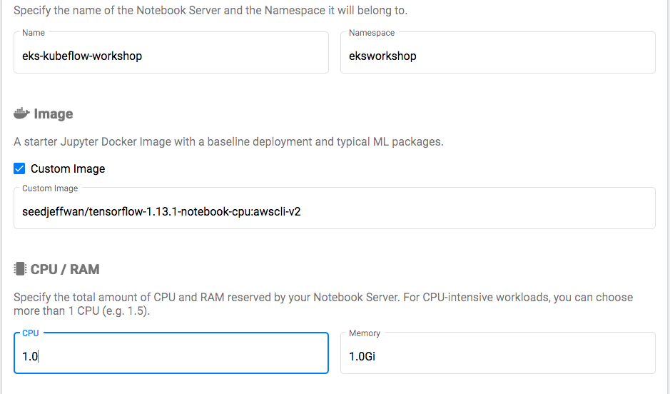
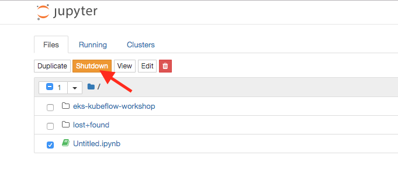
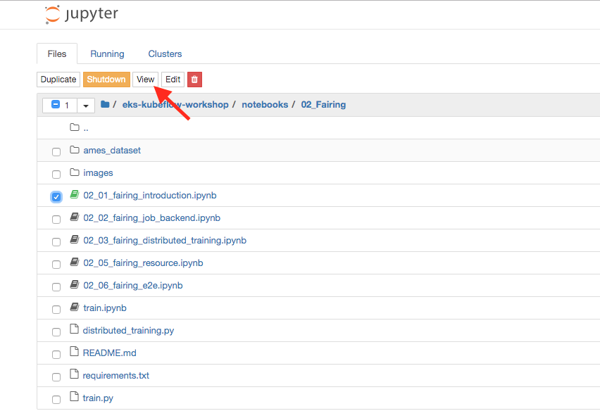
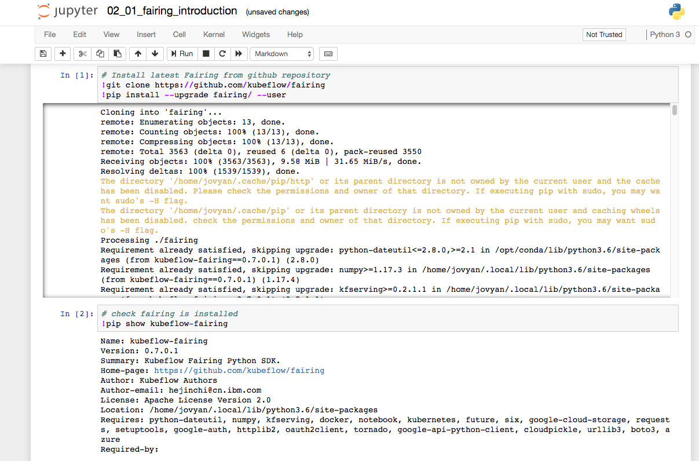
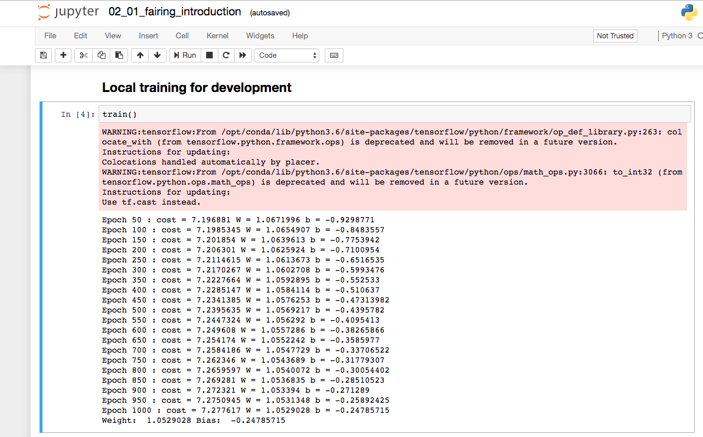
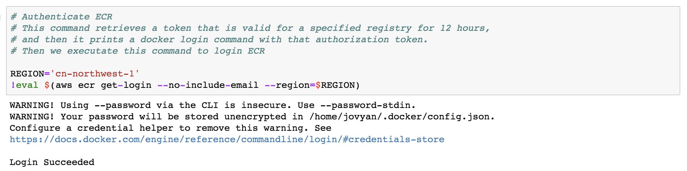
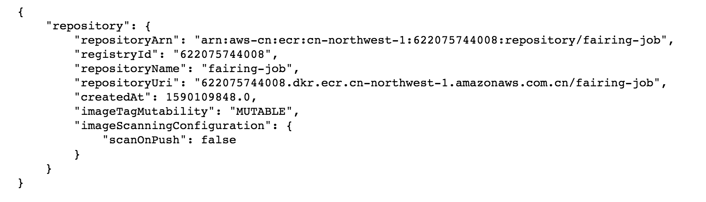
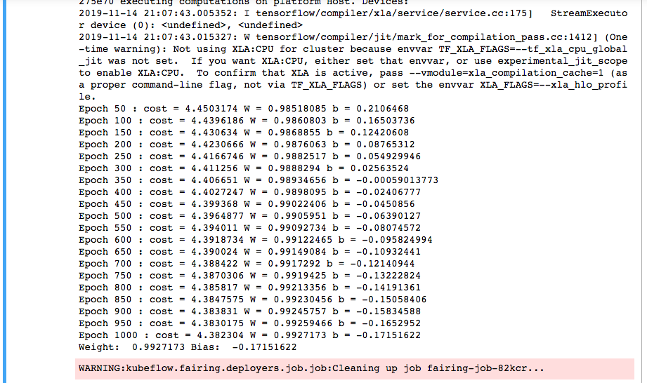

Kubeflow Fairing是一个Python软件包，可轻松在[Kubeflow](https://www.kubeflow.org/docs/about/kubeflow/)上训练和部署ML模型。Kubeflow Fairing还可以扩展为在其他平台上进行培训或部署。目前，Kubeflow Fairing已扩展为可在aws上进行培训。

Kubeflow Fairing将您的Jupyter笔记本，Python函数或Python文件打包为Docker映像，然后在Kubeflow或AI平台上部署并运行培训作业。训练工作完成后，您可以使用Kubeflow Fairing将训练后的模型部署为Kubeflow上的预测端点。

以下是[Kubeflow Fairing项目](https://github.com/kubeflow/fairing)的目标：

- **轻松打包ML培训作业：**使ML从业人员可以轻松地将其ML模型培训代码及其代码依赖性打包为Docker映像。
- **在混合云环境中轻松训练ML模型：**提供用于训练ML模型的高级API，从而使您可以轻松地在云中运行训练作业，而无需了解底层基础结构。
- **简化部署训练有素的模型的过程：**使ML练习者可以轻松地将训练有素的ML模型部署到混合云环境。

#### 创建 Jupyter notebook serve

使用自定义镜像 (seedjeffwan/tensorflow-1.13.1-notebook-cpu:awscli-v2) 创建笔记本，如下图所示： 



#### 克隆实验repo

创建一个新的 Python 3 Notebook.运行一下命令clone本实验repo：

```bash
!git clone https://github.com/aws-samples/eks-kubeflow-workshop.git
```

点击运行. 关闭 notebook tab, 返回 notebook server, 选择刚才使用的notebook 并点击**Shutdown**.

[](https://eksworkshop.com/images/kubeflow/fairing-shutdown-notebook.png)

#### 设置 S3 and ECR 访问许可

在本实验中，我们将同时使用S3和ECR服务。我们将使用S3来存储和访问管道数据。我们将使用ECR作为训练镜像的容器注册表。我们需要将IAM策略添加到工作节点，以便能够访问S3和ECR，在终端中运行以下命令并分配所需的权限：

```bash
aws iam attach-role-policy --role-name $NODE_INSTANCE_ROLE --policy-arn arn:aws:iam::aws:policy/AmazonEC2ContainerRegistryFullAccess

aws iam attach-role-policy --role-name $NODE_INSTANCE_ROLE --policy-arn arn:aws:iam::aws:policy/AmazonS3FullAccess
```

#### 运行 fairing 

浏览**“eks-kubeflow-workshop”**库，转到fairing introduction notebook (eks-kubeflow-workshop/notebook /02_Fairing/02_01_fairing_introduction.ipynb)。您可以点击笔记本打开并点击**查看**



检查内容并单击第一个单元格，然后单击**Run**。这将允许您从Github存储库安装faring，等待安装完成，转到下一个单元格并单击**Run**。如下图：



现在已经安装了fairing，我们将训练用Python编写模型。该模型将创建一个线性回归模型，该模型允许我们从一组给定的连续数据中学习一个函数或关系。例如，我们已知x和对应y的一些数据点我们需要了解它们之间的关系。

在线性回归的情况下，假设是一条直线i。例如, h(x) = x *权值+ b。

运行单元3。完成后，运行单元格4。这将在我们的笔记本上本地创建并训练一个模型



现在，让我们使用fairing，并将图像推入ECR，可用于remote训练,在使用ECR运行authenticate之前，请更改区域为'cn-northwest-1'。运行此单元并登录ECR，以便执行ECR操作

运行下一个单元并在同一区域创建一个ECR存储库(fair -job)。您应该会看到类似的输出





修改 AWS_ACCOUNT_ID为上面registryId的输出，

修改DOCKER_REGISTRY='{}.dkr.ecr.{}.amazonaws.com.cn'.format(AWS_ACCOUNT_ID, AWS_REGION),

如下所示：


运行下一个单元格。Fairing将图像推送到ECR，然后远程部署模型




我们已经成功运行了如何使用fairing在本地和远程进行模型训练
