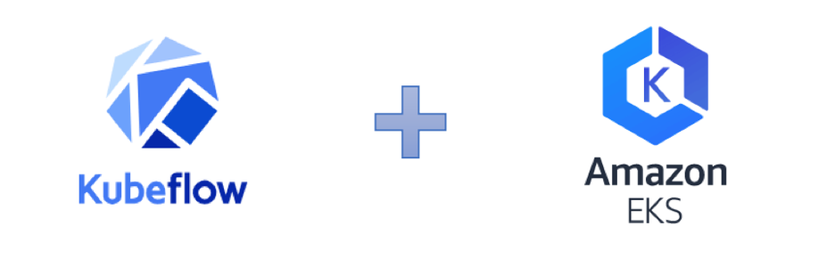

#### 概要 

Kubeflow提供了一种在Kubernetes上运行机器学习工作负载的简单、可移植和可伸缩的方法，使机器学习(ML)工作流在Kubernetes上的部署变得简单、可移植和可伸缩。在本练习中，您将学习如何在EKS中部署和创建Kubeflow，并学会如何在Kubeflow创建和使用jupter notebook，使用TensorFlow运行一个单节点培训和推理，以及如果利用kubeflow fairing将训练后的模型部署为预测端点、学会如何利用pipeline用于定义复杂的机器学习工作流程，并学会如何利用kubeflow进行分布式训练。

 

 在此教程中，您将完成以下实验：

  * [安装Kubeflow](安装Kubeflow.md)

  * [创建和使用jupter notebook](创建和使用jupter笔记本.md)

  * [Kubeflow fairing]准备中......

  * [Kubeflow pipeline]准备中......

  * [Kubeflow 分布式训练]准备中......

  * [清理资源](清理资源.md)

 
