#### 配置kubeflow dashboard

检查kubeflow dashboard状态

```bash
kubectl get service istio-ingressgateway -n istio-system
NAME                   TYPE       CLUSTER-IP      EXTERNAL-IP   PORT(S)                                                                                                                                      AGE
istio-ingressgateway   NodePort   10.100.239.93   <none>        15020:31062/TCP,80:31380/TCP,443:31390/TCP,31400:31400/TCP,15029:32662/TCP,15030:31314/TCP,15031:32088/TCP,15032:30973/TCP,15443:30713/TCP   27h
```

通过kubectl port-forward端口转发映射本地端口到指定的kubeflow dashboard 80端口

```bash
kubectl port-forward svc/istio-ingressgateway -n istio-system 8080:80
```


#### 访问Kubeflow用户界面

从本地网络浏览器输入http://127.0.0.1:8080/，您就可以进入到Kubeflow UI界面，Kubeflow dashboard默认为无身份验证。点击dashboard中 **Start Setup**，设置namespace 得值为 **eksworkshop**

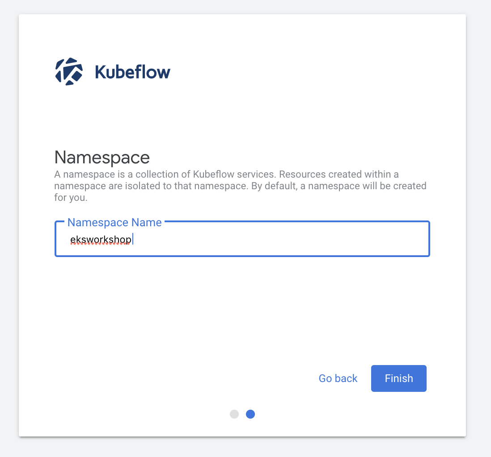


点击 **Finish** 浏览kubeflow dashboard

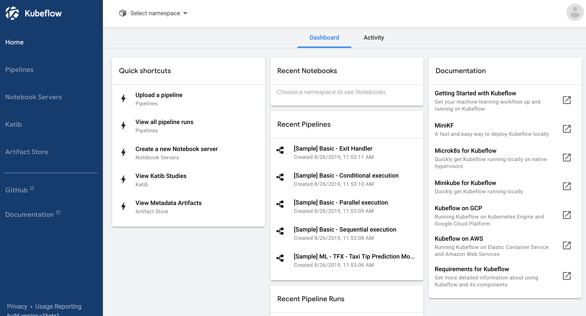


#### 创建和使用jupter notebook

Jupyter notebook 通常用于数据清洗和转换、数值模拟、统计建模、数据可视化、机器学习等。在Kubeflow dashboard中, 点击 **Create a new Notebook server**:

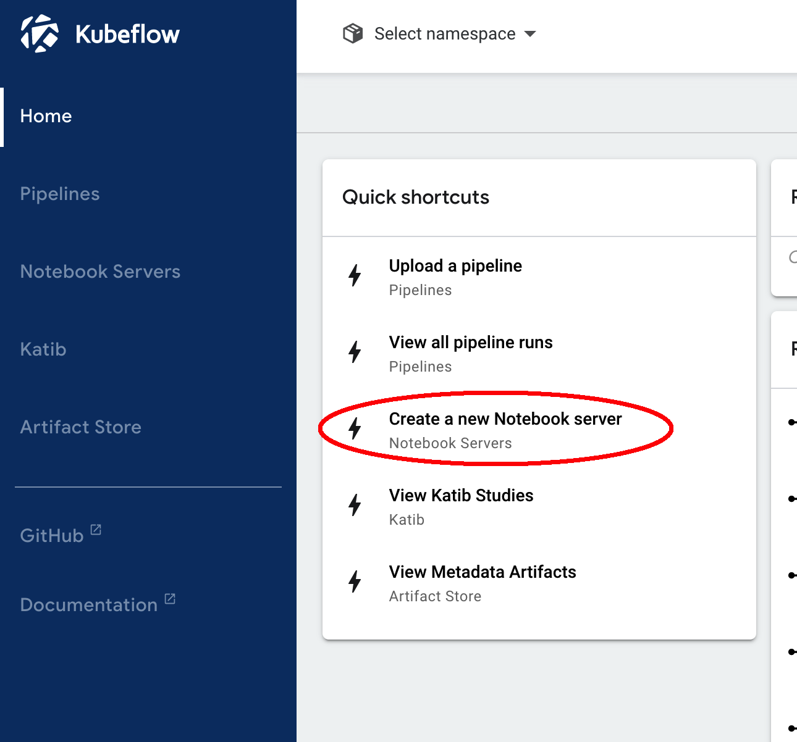


选择您在上一个部步骤中创建的 namespace ：

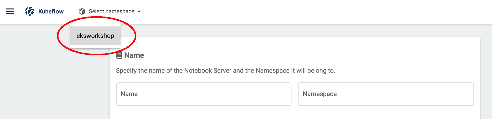


为jupter notebook指定一个名称:

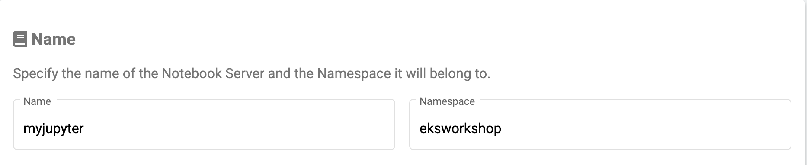

选择Image如下：

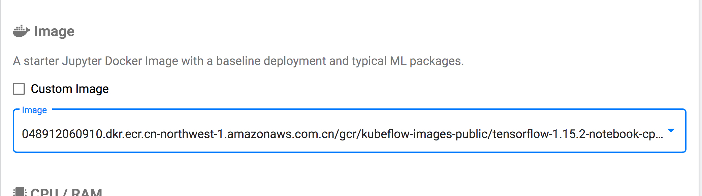


为创建jupter notebook设置CPU值为 **1.0**:

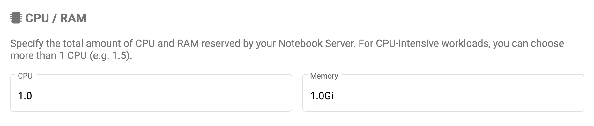

滚动到底部，接受所有其他默认设置，然后单击LAUNCH。等待jupter notebook启动。点击**CONNECT**

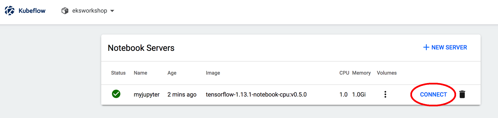


在jupter notebook界面里点击 **New**, 选择 **Python3**，创建一个空 Python 3 Jupyter notebook

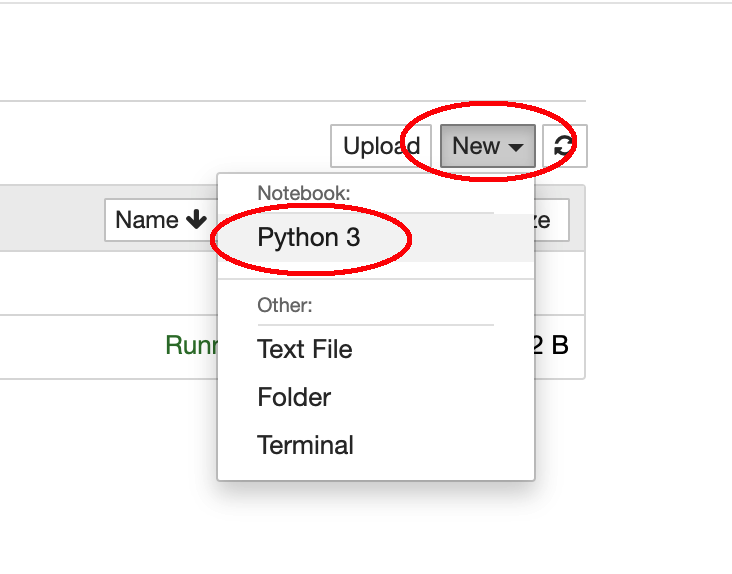

#### 训练模型

打开 src/mnist-tensorflow-jupyter.py并把代码粘贴到notebook中. 这段Python样例代码会使用TensorFlow基于MNIST数据集训练模型，点击Run运行训练代码。

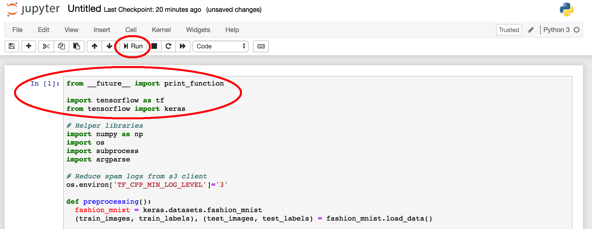

运行后会创建一个新的代码块，在这个新代码块中输入main()，然后单击Run

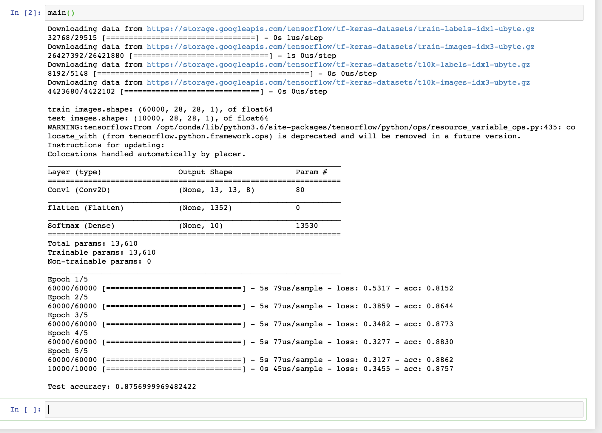

训练完成后，前几行显示下载了TensorFlow和Keras数据集。训练数据集是60k图像，测试数据集为10k图像，并给出了用于训练的超参数，五次Epoch的输出，训练完成后输出了模型的精度。

#### 清理资源

使用以下命令将其删除

```bash
cd  ${KF_DIR} 
#这将删除通过kfctl创建的kubeflow和istio-system名称空间。
kfctl delete -f ${CONFIG_FILE} 
#删除eks cluster
eksctl delete cluster kubeflow
```

如果eksclt delete失败，请手动删除CloudFormation堆栈。将策略手动添加到IAM角色或更改安全组甚至可能失败，因此您可能需要手动还原或删除它。如果您忘记删除它，则需要付费，因此您可能需要在AWS管理控制台中确认删除。

