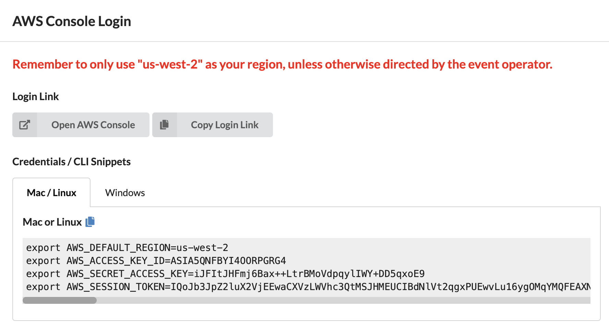

# 进入实验环境


# 步骤1: 通过AWS Cloud9搭建服务器环境
AWS Cloud9 为您提供了EC2基础设施资源并且一个可视化的编辑器。在本次实验中，您将通过Cloud9去创建一台具有公网访问权限的EC2 实例，运行后续的实验。

1.1 通过浏览器进入 https://dashboard.eventengine.run/ ,填入12位hash code


通过点击AWS Console , Open AWS Console 进入aws 控制台



1.2 打开AWS管理控制台，在Service菜单栏中输入关键字Cloud9，进入Cloud9 管理页面


1.3 点击Create environment,在Environment name and Description内输入 环境的名称 [username]_cloud9，点击 Next Step。


1.4 保持界面上的默认配置，本次实验不需要改动任何实例环境和网路环境， 点击 Next step


   

1.5 进入Review界面后，确认无误，点击Create Environment完成创建。此后界面会跳转到 Cloud9 的编辑器页面


**样式**默认是深色,可以修改为白色


1.6	Cloud9 通常使用动态生成 IAM 的认证授权信息，但目前和 EKS IAM Authentication 不兼容，因此我们直接给 Cloud 9 EC2 实例附加一个管理员权限的 IAM 角色，并禁止掉 Cloud9 默认的动态 IAM认证授权信息：

* 1）	创建 IAM 角色

> (1)请新开一个页面,进入[https://console.aws.amazon.com/iam/home#/roles](https://console.aws.amazon.com/iam/home#/roles),选择创建角色 第一步选择 AWS service 并选择 EC2,点击下一步


> (2)权限中选择 AdministratorAccess,点击下一步


> (3)输入角色名字 eksworkshop-admin,点击创建角色


* 2）	在EC2 Instances界面选择cloud9的EC2实例(名字为aws-cloud9-xxxxx),点击Actions/Instance Settings/Attach/Replace IAM Role,为该实例设置正确的角色

  
  
>   选择eksworkshop-admin 角色,点击Apply完成


* 3）	关闭cloud9临时权限，并验证角色是否生效

>点击AWS Cloud9图标 -> Preferences - >AWS Settings ->关闭临时权限

* 

输入:

```bash
#设置默认region
export AWS_DEFAULT_REGION=us-west-2
echo "export AWS_DEFAULT_REGION=${AWS_DEFAULT_REGION}" >> ~/.bashrc


#测试角色是否生效
aws sts get-caller-identity
```
如果可以正常返回以下内容(包含eksworkshop-admin),则表示已经正确设置角色权限
```json
{
    "Account": "<your account id, etc.11111111>", 
    "UserId": "AROAYVRRQ4TUEIX4VRZLN:i-0e011f5bb16f38173", 
    "Arn": "arn:aws:sts:: <your account id, etc.11111111>:assumed-role/eksworkshop-admin/i-0e011f5bb16f38173"
}
```


