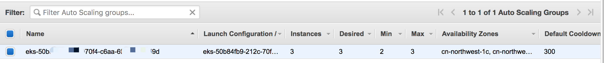

# 步骤5 使用HPA对Pod进行自动扩展， 使用CA对集群进行自动扩展

> 本节目的
1. 为集群配置一个HPA，并且部署一个应用进行压力测试，验证Pod 横向扩展能力。
2. 为集群配置一个CA，使用CA对集群进行自动扩展

[官方文档](https://kubernetes.io/docs/tasks/run-application/horizontal-pod-autoscale-walkthrough/#increase-load)

5.1 使用HPA对Pod进行自动扩展

5.1.1 Install Metrics Server

```bash
# 下载Metrics Server
mkdir -p hpa && cd hpa
curl -Ls https://api.github.com/repos/kubernetes-sigs/metrics-server/tarball/v0.3.6  -o metrics-server-v0.3.6.tar.gz
mkdir -p metrics-server-v0.3.6
tar -xzf metrics-server-v0.3.6.tar.gz --directory metrics-server-v0.3.6 --strip-components 1

kubectl apply -f metrics-server-v0.3.6/deploy/1.8+/
kubectl logs -n kube-system $(kubectl get po -n kube-system | egrep -o metrics-server[a-zA-Z0-9-]+)

# 验证 Metrics Server installation
kubectl get deployment metrics-server -n kube-system
kubectl get apiservice v1beta1.metrics.k8s.io -o yaml
```

5.1.2 安装 HPA sample application php-apache
```bash
kubectl apply -f https://k8s.io/examples/application/php-apache.yaml

# Set threshold to CPU30% auto-scaling, and up to 5 pod replicas
kubectl autoscale deployment php-apache --cpu-percent=30 --min=1 --max=5
kubectl get hpa
```

5.1.3 开启 load-generator
```bash
kubectl run --generator=run-pod/v1 -it --rm load-generator --image=busybox /bin/sh

# 提示框输入
while true; do wget -q -O- http://php-apache.default.svc.cluster.local; done
```

5.1.4 Check HPA
```bash

watch kubectl get hpa
NAME         REFERENCE               TARGETS    MINPODS   MAXPODS   REPLICAS   AGE
php-apache   Deployment/php-apache   250%/30%   1         5         4          3m22s

kubectl get deployment php-apache
NAME         READY   UP-TO-DATE   AVAILABLE   AGE
php-apache   5/5     5            5           6m2s

```

5.2 使用CA对集群进行自动扩展

适用于AWS的Cluster Autoscaler提供与Auto Scaling Group 集成。 它使用户可以从四个不同的部署选项中进行选择：
1. 一个Auto Scaling Group - 本节使用的方式
2. 多个Auto Scaling组
3. 自动发现 Auto-Discovery
4. 主节点设置

5.2.1 配置Cluster Autoscaler (CA)
```bash
mkdir cluster-autoscaler && cd cluster-autoscaler
wget https://www.eksworkshop.com/beginner/080_scaling/deploy_ca.files/cluster-autoscaler-autodiscover.yaml
cp cluster-autoscaler-autodiscover.yaml cluster_autoscaler.yml  

K8S_VERSION=$(kubectl version --short | grep 'Server Version:' | sed 's/[^0-9.]*\([0-9.]*\).*/\1/' | cut -d. -f1,2)

AUTOSCALER_VERSION=$(curl -s "https://api.github.com/repos/kubernetes/autoscaler/releases" | grep '"tag_name":' | sed 's/.*-\([0-9][0-9\.]*\).*/\1/' | grep -m1 ${K8S_VERSION})
```

5.2.2 Configure the Auto Scaling Group ASG

修改Capacity为
Min: 2
Max: 6

5.2.3 Apply CA
```bash
# Replace the placeholder value
${AUTOSCALER_VERSION}
<AUTOSCALING GROUP NAME>
<AWS_REGION_NAME> 
This specifies the minimum nodes (2), max nodes (8) and ASG Name.

# Apply IAM Policy
STACK_NAME=$(eksctl get nodegroup --cluster ${CLUSTER_NAME} --region=${AWS_REGION} -o json | jq -r '.[].StackName')
echo $STACK_NAME
ROLE_NAME=$(aws cloudformation describe-stack-resources --stack-name $STACK_NAME --region=${AWS_REGION} | jq -r '.StackResources[] | select(.ResourceType=="AWS::IAM::Role") | .PhysicalResourceId')
echo $ROLE_NAME

cat <<EoF > k8s-asg-policy.json
{
    "Version": "2012-10-17",
    "Statement": [
        {
            "Action": [
                "autoscaling:DescribeAutoScalingGroups",
                "autoscaling:DescribeAutoScalingInstances",
                "autoscaling:DescribeLaunchConfigurations",
                "autoscaling:DescribeTags",
                "autoscaling:SetDesiredCapacity",
                "autoscaling:TerminateInstanceInAutoScalingGroup",
                "ec2:DescribeLaunchTemplateVersions"
            ],
            "Resource": "*",
            "Effect": "Allow"
        }
    ]
}
EoF

aws iam put-role-policy --role-name $ROLE_NAME --policy-name ASG-Policy-For-Worker --policy-document file://k8s-asg-policy.json --region ${AWS_REGION}

aws iam get-role-policy --role-name $ROLE_NAME --policy-name ASG-Policy-For-Worker --region ${AWS_REGION}

# Deploy CA
kubectl apply -f cluster-autoscaler/cluster_autoscaler.yml
kubectl get pod -n kube-system -o wide \
    $(kubectl get po -n kube-system | egrep -o cluster-autoscaler[a-zA-Z0-9-]+)
kubectl logs -f deployment/cluster-autoscaler -n kube-system


```

5.2.4 Scale cluster
```bash
# 准备nginx-to-scaleout.yaml
cat <<EoF> nginx-to-scaleout.yaml
apiVersion: apps/v1
kind: Deployment
metadata:
  name: nginx-to-scaleout
spec:
  replicas: 1
  selector:
    matchLabels:
      app: nginx
  template:
    metadata:
      labels:
        service: nginx
        app: nginx
    spec:
      containers:
      - image: nginx
        name: nginx-to-scaleout
        resources:
          limits:
            cpu: 500m
            memory: 512Mi
          requests:
            cpu: 500m
            memory: 512Mi
EoF

# 部署
kubectl apply -f nginx-to-scaleout.yaml
kubectl get deployment/nginx-to-scaleout
NAME                READY   UP-TO-DATE   AVAILABLE   AGE
nginx-to-scaleout   1/1     1            1           43s

# Scale out the ReplicaSet
kubectl scale --replicas=10 deployment/nginx-to-scaleout

kubectl get pods --watch
NAME                                 READY   STATUS    RESTARTS   AGE
busybox                              1/1     Running   0          22h
nginx-to-scaleout-84f9cdbd84-2tklw   1/1     Running   0          17m
nginx-to-scaleout-84f9cdbd84-4rs5d   1/1     Running   0          17m
nginx-to-scaleout-84f9cdbd84-72sb7   1/1     Running   0          17m
nginx-to-scaleout-84f9cdbd84-7rdjb   1/1     Running   0          17m
nginx-to-scaleout-84f9cdbd84-9kpt6   1/1     Running   0          17m
nginx-to-scaleout-84f9cdbd84-h4fd7   1/1     Running   0          17m
nginx-to-scaleout-84f9cdbd84-hxxq7   1/1     Running   0          17m
nginx-to-scaleout-84f9cdbd84-pxhc5   1/1     Running   0          19m
nginx-to-scaleout-84f9cdbd84-snbc7   1/1     Running   0          17m
nginx-to-scaleout-84f9cdbd84-snd56   1/1     Running   0          17m

kubectl logs -f deployment/cluster-autoscaler -n kube-system

#Check the AWS Management Console to confirm that the Auto Scaling groups are scaling up to meet demand. 
aws ec2 describe-instances --filters "Name=tag:eks:cluster-name,Values=${CLUSTER_NAME}" --query "Reservations[].Instances[].[InstanceId,State.Name]" --region ${AWS_REGION}

[
    [
        "i-00a58166f01483577",
        "running"
    ],
    [
        "i-028933f3a55edae59",
        "running"
    ],
    [
        "i-01adcd8b6e3c7ce8c",
        "running"
    ],
    [
        "i-02e545c32952d9879",
        "running"
    ]
]

```

5.2.5 clean up
```bash
kubectl delete -f cluster-autoscaler/nginx-to-scaleout.yaml
kubectl delete -f cluster-autoscaler/cluster_autoscaler.yml
```
