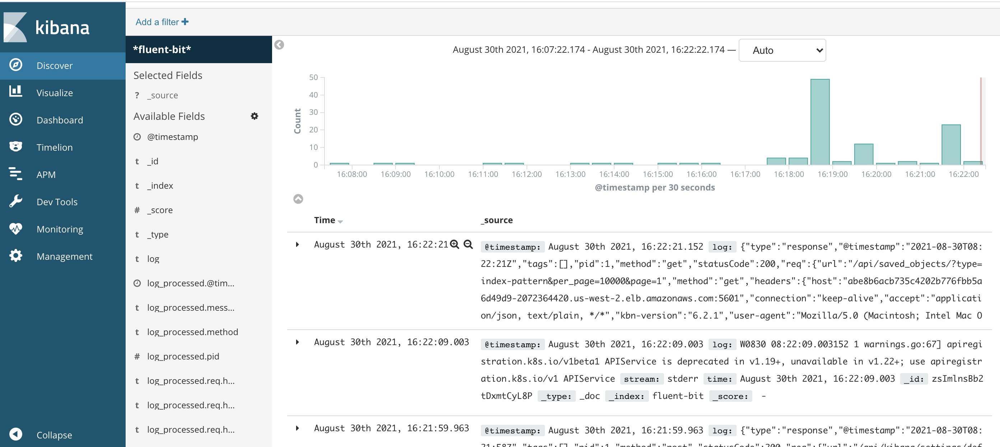

### 可观察性1 - 日志收集

1. 配置elasticsearch

   为了简化实验，我们使用了一个单节点ElasticSearch来接受fluent-bit的数据,生产环境请正确配置集群版本

   ```bash
   cd observeration
   kubectl apply -f elastisearch.yaml
   
   #测试elasticsearch 是否正常工作
   kubectl port-forward service/elasticsearch 9200:9200
   
   #新开一个终端,使用curl 测试
   curl localhost:9200
   
   #参考返回
   {
     "name" : "wdpc0YA",
     "cluster_name" : "docker-cluster",
     "cluster_uuid" : "XAFghJJLRYmBWpg85oPBsA",
     "version" : {
       "number" : "6.6.1",
       "build_flavor" : "default",
       "build_type" : "tar",
       "build_hash" : "1fd8f69",
       "build_date" : "2019-02-13T17:10:04.160291Z",
       "build_snapshot" : false,
       "lucene_version" : "7.6.0",
       "minimum_wire_compatibility_version" : "5.6.0",
       "minimum_index_compatibility_version" : "5.0.0"
     },
     "tagline" : "You Know, for Search"
   }
   
   ```

   

2. 配置fluent-bit

   > 部署fluent-bit

    ```bash
    kubectl apply -f fluent-bit.yaml
    
    kubectl get pod | grep fluent | awk '{print $1}' | xargs -n1 kubectl logs 
    
    #参考输出
    AWS for Fluent Bit Container Image Version 2.5.0
    Fluent Bit v1.5.0
    * Copyright (C) 2019-2020 The Fluent Bit Authors
    * Copyright (C) 2015-2018 Treasure Data
    * Fluent Bit is a CNCF sub-project under the umbrella of Fluentd
    * https://fluentbit.io
    
    [2021/09/01 02:22:47] [ info] [engine] started (pid=1)
    [2021/09/01 02:22:47] [ info] [storage] version=1.0.4, initializing...
    [2021/09/01 02:22:47] [ info] [storage] in-memory
    [2021/09/01 02:22:47] [ info] [storage] normal synchronization mode, checksum disabled, max_chunks_up=128
    [2021/09/01 02:22:47] [ info] [filter:kubernetes:kubernetes.0] https=1 host=kubernetes.default.svc port=443
    [2021/09/01 02:22:47] [ info] [filter:kubernetes:kubernetes.0] local POD info OK
    [2021/09/01 02:22:47] [ info] [filter:kubernetes:kubernetes.0] testing connectivity with API server...
    [2021/09/01 02:22:47] [ warn] [filter:kubernetes:kubernetes.0] could not get meta for POD fluent-bit-nlk8x
    [2021/09/01 02:22:47] [ info] [http_server] listen iface=0.0.0.0 tcp_port=2020
    [2021/09/01 02:22:47] [ info] [sp] stream processor started
    [2021/09/01 02:22:47] [ info] inotify_fs_add(): inode=102760595 watch_fd=1 name=/var/log/containers/aws-node-jjj8r_kube-system_aws-node-4287db63a2859ed2fd3813d0dc04983fc7e1ef80949ed742d4594952c8b7a144.log
    [2021/09/01 02:22:47] [ info] inotify_fs_add(): inode=5248234 watch_fd=2 name=/var/log/containers/aws-node-jjj8r_kube-system_aws-node-5aebf7b7a041e11ecb128e7794533866caf9a08652c532b7ad07e48bb9677aef.log
    [2021/09/01 02:22:47] [ info] inotify_fs_add(): inode=140510387 watch_fd=3 name=/var/log/containers/aws-node-jjj8r_kube-system_aws-vpc-cni-init-ad363a5b086f318f3423eb19c625540ecc3bee355ce4b8824ca30cf175645b17.log
    [2021/09/01 02:22:47] [ info] inotify_fs_add(): inode=47212466 watch_fd=4 name=/var/log/containers/cert-manager-db4ccd57b-n6j6h_cert-manager_cert-manager-e71e1ebbebf005fd1dc40eebc938dcbc5f2f41681343e06ee0500c67f6591ab9.log
    [2021/09/01 02:22:47] [ info] inotify_fs_add(): inode=4390551 watch_fd=5 name=/var/log/containers/cert-manager-webhook-79c5595878-jnhnn_cert-manager_cert-manager-14d77f8b037e51dc10b4c00c360631aaf404123bf18ae363bd039875aa3625be.log
    [2021/09/01 02:22:47] [ info] inotify_fs_add(): inode=34620536 watch_fd=6 name=/var/log/containers/elasticsearch-67f4cf7798-cv8s6_default_elasticsearch-4cbc0cff0db79b01471775b5cb1ae596706a505d06595099cbef377c2255ddf4.log
    [2021/09/01 02:22:47] [ info] inotify_fs_add(): inode=28383507 watch_fd=7 name=/var/log/containers/elasticsearch-67f4cf7798-cv8s6_default_set-vm-sync-limit-5dbed0e26e0950d9e354401881b29f96c411f9715c68429229f048c7e9861e13.log
    [2021/09/01 02:22:47] [ info] inotify_fs_add(): inode=45090899 watch_fd=8 name=/var/log/containers/kube-proxy-bncf9_kube-system_kube-proxy-9691935255cbab98a944de05b72274e6288aadb0f8997729f29be52695619a12.log
    [2021/09/01 02:22:47] [ info] inotify_fs_add(): inode=109053826 watch_fd=9 name=/var/log/containers/kube-proxy-bncf9_kube-system_kube-proxy-ba3264b1d693a8a845419ca6099077520468594760f92ee2756bd1435cd41503.log
    [2021/09/01 02:22:47] [ info] inotify_fs_add(): inode=148908484 watch_fd=10 name=/var/log/containers/cert-manager-cainjector-68b467c55f-cg7pm_cert-manager_cert-manager-73b8e807e007fc16a1624f6e670333e53c09927f263a7ecb828dea66fb066315.log
    [2021/09/01 02:22:47] [ info] inotify_fs_add(): inode=46145117 watch_fd=11 name=/var/log/containers/fluent-bit-nlk8x_default_fluent-bit-b19c2816d74c9b3e565be28359d1660fd6e739d8efa2ecb88d1bc6ce7832bd5f.log


3. 配置kibana

   > 安装kibana

   ```bash
   kubectl apply -f kibana.yaml
   
   #获取kibana地址
   kubectl get svc --field-selector=metadata.name=kibana | tail -1 | awk '{print $4}'
   
   ```

   

> 在浏览器输入kibana地址, 点击左侧菜单Discover , 创建index pattern ,输入\*fluent-bit\*


> 选择时间字段


> 选择discover




4. 清除

   ```bash
   kubectl delete -f kibana.yaml
   kubectl delete -f fluent-bit.yaml
   kubectl delete -f elasticsearch.yaml
   ```

   