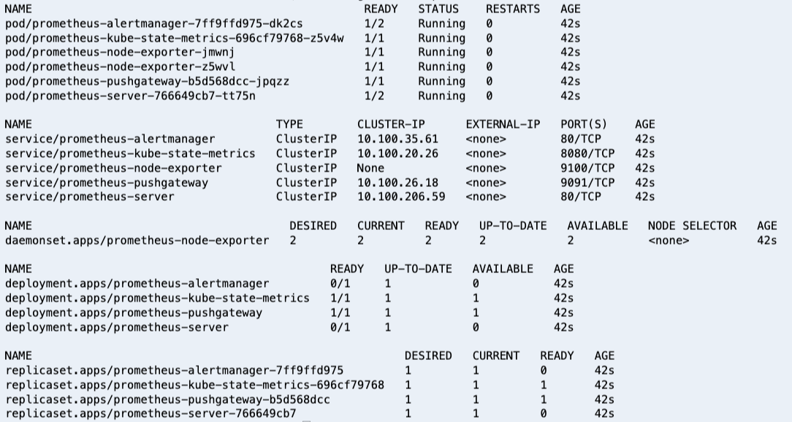
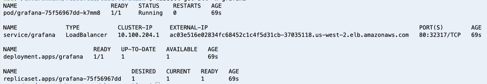
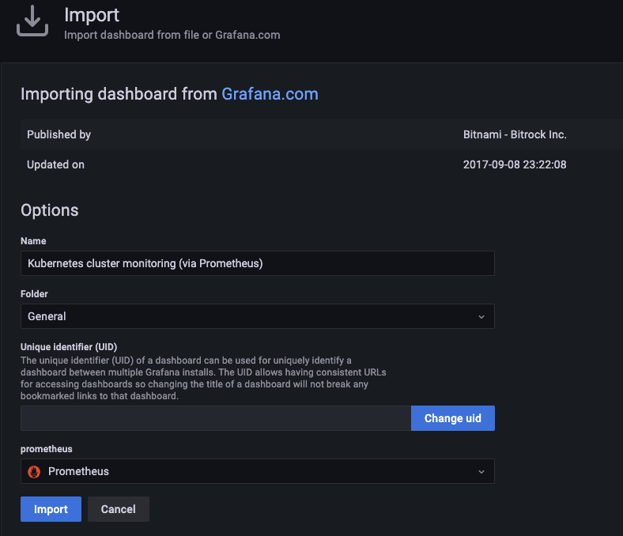

### 可观察性2 - Prometheus&Grafana


1. 安装helm

   ```bash
   curl -sSL https://raw.githubusercontent.com/helm/helm/master/scripts/get-helm-3 | bash
   
   helm version --short
   
   # 增加 prometheus Helm repo
   helm repo add prometheus-community https://prometheus-community.github.io/helm-charts
   
   # 增加 grafana Helm repo
   helm repo add grafana https://grafana.github.io/helm-charts
   
   
   ```

2. 部署Prometheus

   ```ba
   kubectl create namespace prometheus
   
   helm install prometheus prometheus-community/prometheus \
       --namespace prometheus \
       --set alertmanager.persistentVolume.storageClass="gp2" \
       --set server.persistentVolume.storageClass="gp2"
   
   kubectl get all -n prometheus
   ```

   输出:

   


3. 部署Grafana

   ```bash
   kubectl create namespace grafana
   
   helm install grafana grafana/grafana \
       --namespace grafana \
       --set persistence.storageClassName="gp2" \
       --set persistence.enabled=true \
       --set adminPassword='EKS!sAWSome' \
       --values grafana.yaml \
       --set service.type=LoadBalancer
   ```

   

   

   获取grafana访问地址

   ```bash
   export ELB=$(kubectl get svc -n grafana grafana -o jsonpath='{.status.loadBalancer.ingress[0].hostname}')
   echo "http://$ELB"
   kubectl get secret --namespace grafana grafana -o jsonpath="{.data.admin-password}" | base64 --decode ; echo
   
   ```

   

   

   > 输入3119,点击load

   

   > 选择promethus 数据源, 点击导入

   

   

   

   

   > Pod Monitoring Dashboard 重复上述操作，将3119更换为6417

   

   

4. 清除资源

   ```bash
   helm uninstall prometheus --namespace prometheus
   kubectl delete ns prometheus
   
   helm uninstall grafana --namespace grafana
   kubectl delete ns grafana
   
   ```

   


