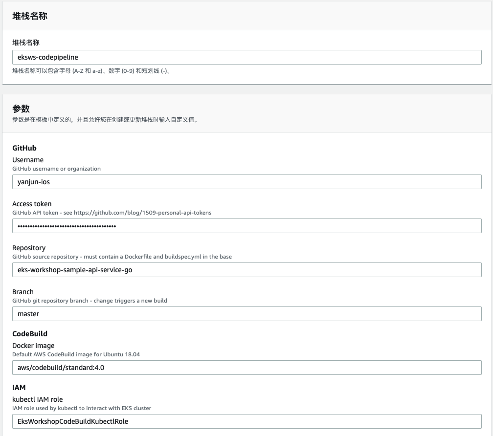
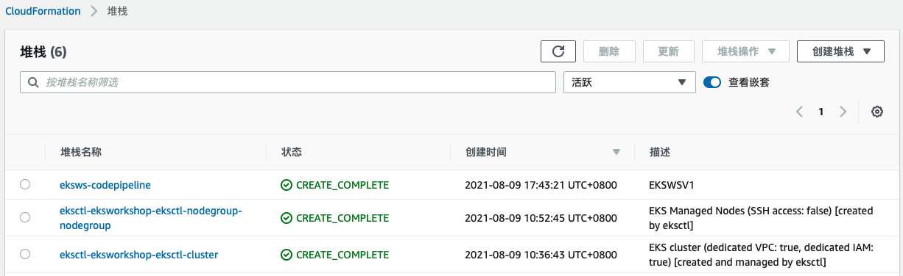
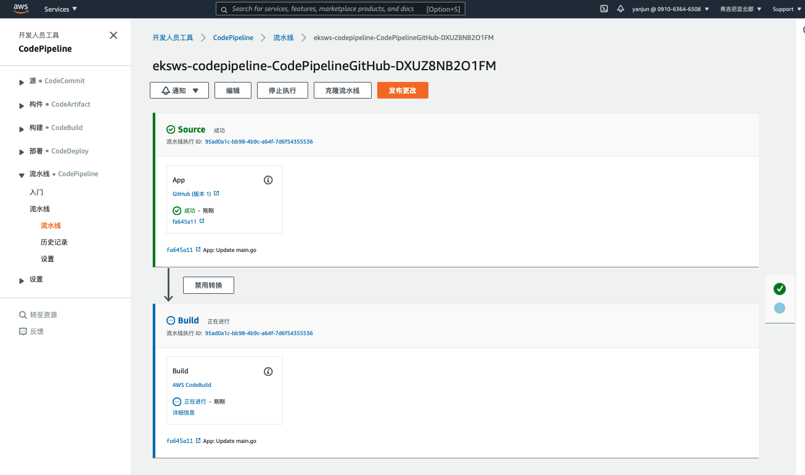
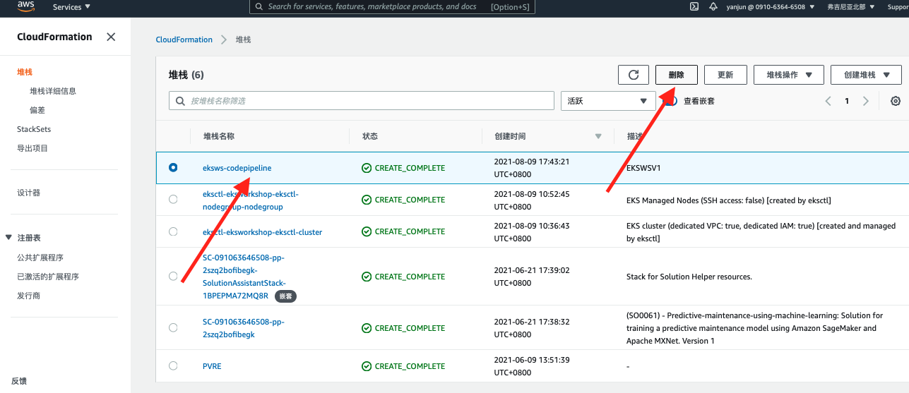

# 步骤7 使用CodePipeline实现EKS的CI/CD

持续集成 (CI) 和持续交付 (CD) 对于灵活的组织至关重要。 当团队可以频繁地进行离散更改、以编程方式发布这些更改并在不中断的情况下交付更新时，他们的工作效率会更高。在下面的模块中我们将使用AWS CodePipeline构建CI/CD管道，并利用 CI/CD 管道部署一个示例 Kubernetes 服务，我们将对 GitHub 存储库进行更改并观察此更改对集群的自动交付。

## 创建IAM角色

在 AWS CodePipeline 中，我们将使用 AWS CodeBuild 部署示例 Kubernetes 服务。 这需要一个能够与 EKS 集群交互的 AWS Identity and Access Management (IAM) 角色。

在这一步中，我们将创建一个 IAM 角色并添加一个内联策略，我们将在 CodeBuild 阶段使用该策略通过 kubectl 与 EKS 集群交互。

```bash
cd codepipeline

ACCOUNT_ID=$(aws sts get-caller-identity | jq -r .Account)
TRUST="{ \"Version\": \"2012-10-17\", \"Statement\": [ { \"Effect\": \"Allow\", \"Principal\": { \"AWS\": \"${ACCOUNT_ID}\" }, \"Action\": \"sts:AssumeRole\" } ] }"

echo '{ "Version": "2012-10-17", "Statement": [ { "Effect": "Allow", "Action": "eks:Describe*", "Resource": "*" } ] }' > iam-role-policy

aws iam create-role --role-name EksWorkshopCodeBuildKubectlRole --assume-role-policy-document "$TRUST" --output text --query 'Role.Arn'

aws iam put-role-policy --role-name EksWorkshopCodeBuildKubectlRole --policy-name eks-describe --policy-document file://./iam-role-policy

```

## 修改AWS Auth Config Map

现在我们已经创建了 IAM 角色，我们将将该角色添加到 EKS 集群的 aws-auth ConfigMap。

一旦 ConfigMap 包含这个新角色，管道 CodeBuild 阶段中的 kubectl 将能够通过 IAM 角色与 EKS 集群交互。

```bash
ROLE="    - rolearn: arn:aws:iam::${ACCOUNT_ID}:role/EksWorkshopCodeBuildKubectlRole\n      username: build\n      groups:\n        - system:masters"

kubectl get -n kube-system configmap/aws-auth -o yaml | awk "/mapRoles: \|/{print;print \"$ROLE\";next}1" > ./aws-auth-patch.yml

kubectl patch configmap/aws-auth -n kube-system --patch "$(cat ./aws-auth-patch.yml)"
```

⚠️ 注意：如果您想手动编辑 aws-auth ConfigMap   您可以执行: $ kubectl edit -n kube-system configmap/aws-auth

## 从 GitHub FORK 演示用的代码仓库

我们现在将 Fork 示例 Kubernetes 服务，以便我们能够修改存储库并触发构建。
登录 GitHub 并将示例服务 fork 到您自己的帐户：
https://github.com/rnzsgh/eks-workshop-sample-api-service-go


一旦仓库被Fork成功，您可以在个人账号的代码仓库中看到它，类似于下面这样

请修改Dockerfile 使用AWS public registry ,避免dockerhub 免费账号pull limit 限制错误

```bash
#FROM golang:1.11.1 as builder
FROM public.ecr.aws/o7x6j3x6/golang:1.11.1 as builder
```


## 配置GitHub访问token

为了让 CodePipeline 从 GitHub 接收回调，我们需要生成个人访问令牌。

创建后，访问令牌可以存储在安全的 enclave 中并重复使用，因此仅在第一次运行或需要生成新密钥时才需要执行此步骤。

在 GitHub 中访问以下页面创建新的token https://github.com/settings/tokens/new


## Codepipeline 设置

现在我们将使用 AWS CloudFormation 创建 AWS CodePipeline。

CloudFormation 是一种基础设施即代码 (IaC) 工具，它为您提供一种通用语言来描述和供应云环境中的所有基础设施资源。 CloudFormation 允许您使用一个简单的文本文件，以自动化和安全的方式为您的所有区域和账户的应用程序所需的所有资源建模和配置。

每个 EKS 部署/服务都应该有自己的 CodePipeline 并位于隔离的源存储库中。

您可以修改随本研讨会提供的 CloudFormation 模板以满足您的系统要求，从而轻松地将新服务载入您的 EKS 集群。 对于每个新服务，可以重复以下步骤。

单击链接以在 AWS 管理控制台中创建 CloudFormation 堆栈。
https://console.aws.amazon.com/cloudformation/home?#/stacks/create/review?stackName=eksws-codepipeline&templateURL=https://s3.amazonaws.com/eksworkshop.com/templates/main/ci-cd-codepipeline.cfn.yml 

(可以在此处下载模板：https://s3.amazonaws.com/eksworkshop.com/templates/main/ci-cd-codepipeline.cfn.yml)

打开Console后，输入github的用户名和上一步中创建的token, 以及最下面的EKS集群名字将默认的eksworkshop-eksctl修改为 *eksworkshop*，勾选 Capabilites , 然后在右下角点击【创建堆栈】



等待状态从“CREATE_IN_PROGRESS”变成“CREATE_COMPLETE”后进行下一步



点击链接https://console.aws.amazon.com/codesuite/codepipeline/pipelines 在控制台上打开CodePipeline，会看到一个以eks-workshop-codepipeline 开头的pipeline，点击进去查看详情


通过kubectl get svc 查看部署的服务


可以看到hello-k8s 的服务已经部署好了，并且对外提供一个ELB的访问域名，我们复制这个域名到浏览器中访问一下:


可以看到Message中返回 Hello Word 信息，表示服务部署成功，可正常对外访问

## 触发新的发布

到目前为止，我们已经使用AWS CodePipeline 设置好了EKS的CI/CD，现在我们对GitHub仓库中的代码进行修改，看是否能够自动构建和发布到EKS集群
打开GitHub 选择刚刚fork的仓库 eks-workshop-sample-api-service-go，点击 main.go 文件，然后点击右上角的【编辑】按钮，将Hello Word,改成其他的字符串，如下改成 Hello Word, CICD on EKS，然后点击【commit changes】按钮，提交修改


在AWS控制台中查看CodePipeline，[https://console.aws.amazon.com/codesuite/codepipeline/pipelines](https://console.aws.amazon.com/codesuite/codepipeline/pipelines/eksws-codepipeline-CodePipelineGitHub-DXUZ8NB2O1FM/view?region=us-east-1)，看到更新正在被自动构建



等待构建完成，再次从浏览器中访问服务


message 信息变成我们在GitHub中提交的更改信息，说明我们的提交已经成功部署到EKS集群中。

至此，基于CodePipeline的EKS CICD搭建并测试完成。

## 环境清理

清理我们在EKS中部署的服务

```
$ kubectl delete deployments hello-k8s
$ kubectl delete services hello-k8s
```

打开CloudFormation控制台，删除创建CodePipeline的堆栈 https://console.aws.amazon.com/cloudformation



删除S3存储桶中的内容


