## Serverless 快速简易 API

### 目的

快速从零开始写一个简易 API。

### 步骤

1. 创建 Lambda 函数并写入逻辑
2. 创建 HTTP API 触发器
3. 测试

### 1. 创建 Lambda 函数并写入逻辑

打开 Lambda 服务。

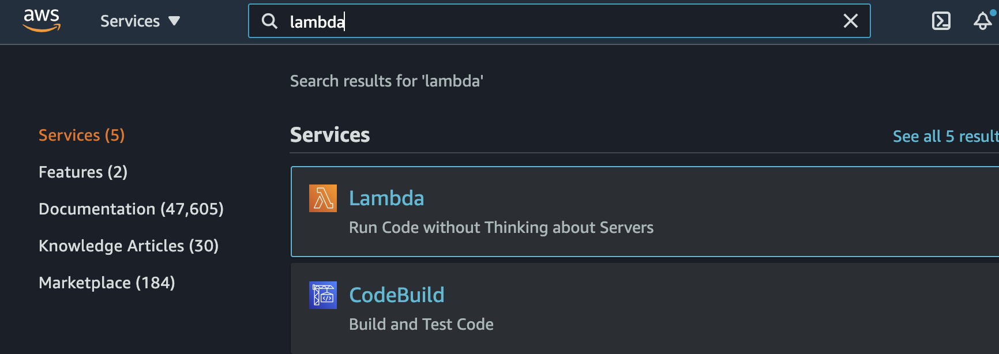

点击「Create function」创建 Lambda 函数。

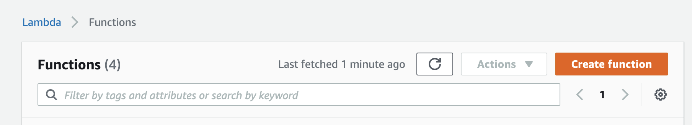

输入 Lambda 名字。我们使用一个 Lambda 函数来应对所有的 API，这种模式叫做「fat Lambda」。反之，如果使用不同的 Lambda 函数来对应不同的 API，就叫做「lean Lambda」。

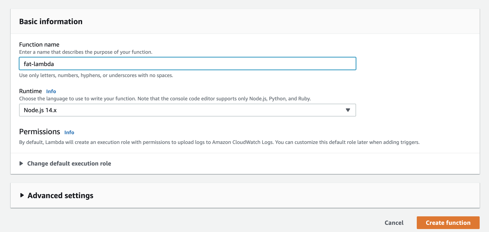

创建完如下。


写入代码。

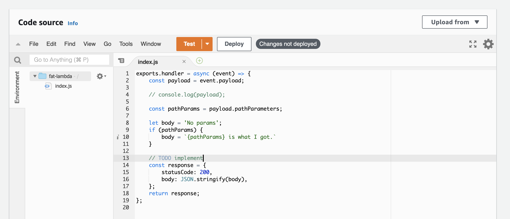

代码如下。

```node
exports.handler = async (event) => {
    // console.log(event);

    const queryParams = event.queryStringParameters;
    const pathParams = event.pathParameters;

    let body = 'No params';    
    if (pathParams) {
        body = `${JSON.stringify(pathParams)} is what I got.`
    } else if (queryParams) {
        body = `${JSON.stringify(queryParams)} is what I got.`
    }

    // TODO implement
    const response = {
        statusCode: 200,
        body: body,
    };
    return response;
};
```

这部分代码会优先打印路径参数，比如 `/topics/{id}` 中的 `{id}`，如果没有的话则打印请求字符串路径，比如 `?id=100` 中的 `id`。

点击「Deploy」保存代码。

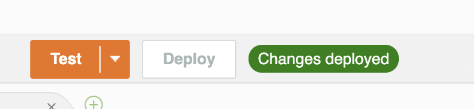

接下来我们做下测试。

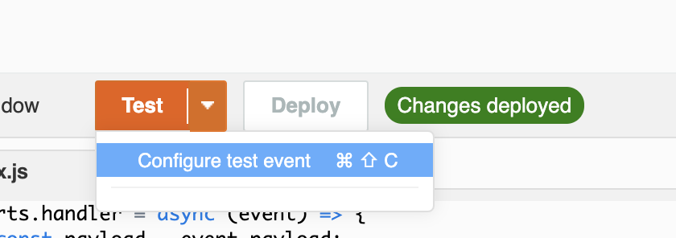

点击「Test」旁边的小三角，点击「Configure test event」，创建测试事件。选择 `apigateway-aws-proxy`，因为后续我们会使用 API Gateway，它发送给 Lambda 的事件就是这个类型。事件名字写作「test」。

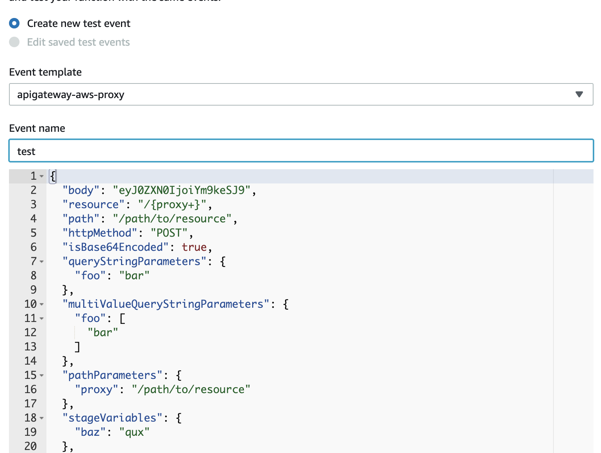

接下来点击测试，选择「test」事件。结果应该如下，成功打印路径参数。

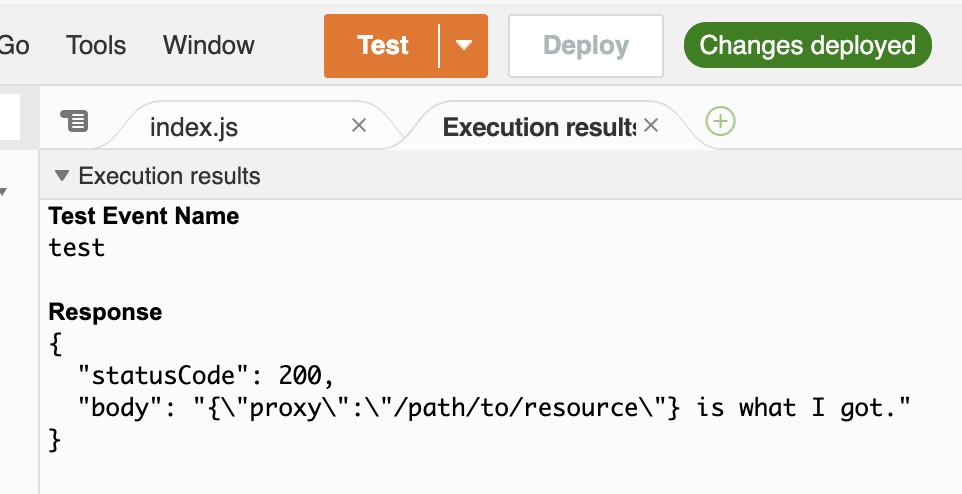

### 2. 创建触发器

接下来创建 API Gateway 触发器。我们可以从 API Gateway 界面添加，也可以在 Lambda 内直接创建添加。为了简便我们从 Lambda 界面添加。点击「Add trigger」。

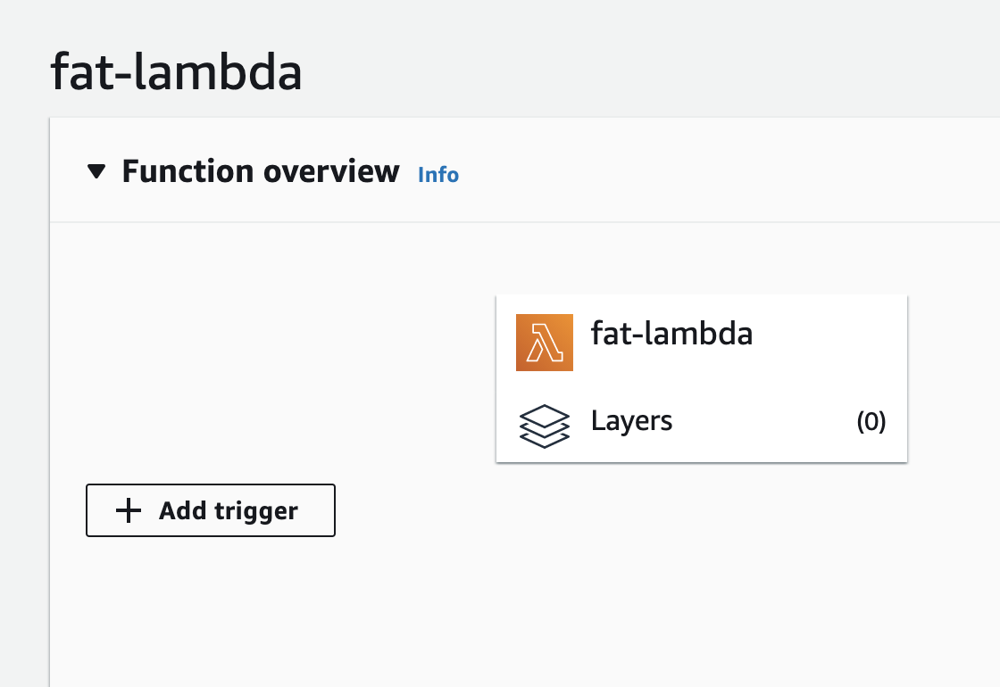

选择「API Gateway」，点击「Create an API」，选择「HTTP API」。为了快速演示效果，我们不使用外部鉴权机制，所以「Security」选择「Open」，即不鉴权。

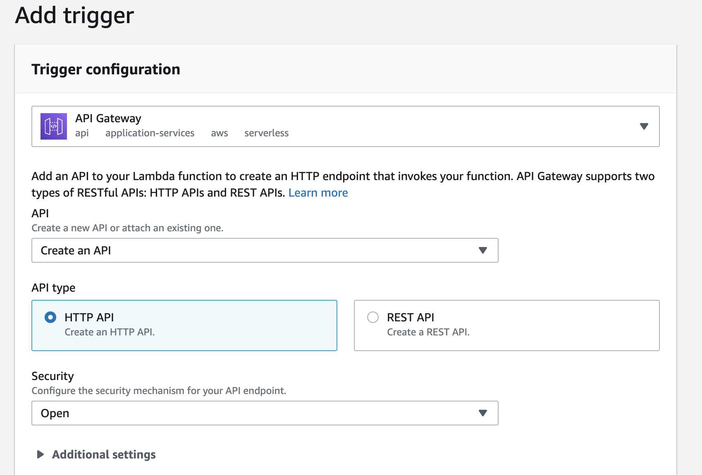

这里我们需要修改一下默认的调用策略，方便我们做更多测试。先刷新一下页面。

接下来，选择「Configuration」标签，在左边选择「Permissions」，下拉至「Resource-based policy」，点击唯一一条记录的链接，点击「Edit」按钮。

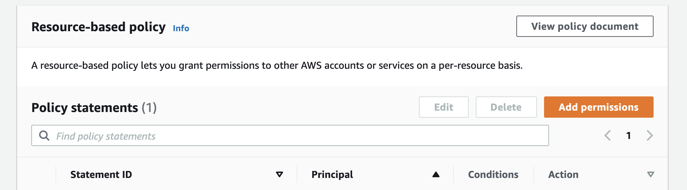

把「Source Arn」下尾部的 `.../*/*/fat-lambda` 改成 `.../*`，并保存。

### 3. 测试

接下来，找到「Configuration」标签页下的「Triggers」，然后点击 API Gateway 的链接到 API Gateway 界面。

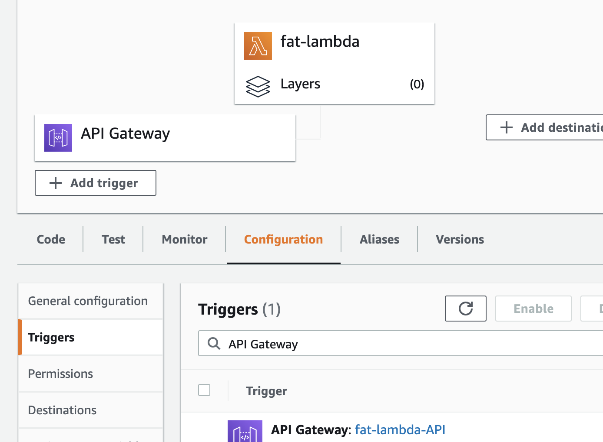

找到如下链接。


直接在浏览器调用，显示「No params」。

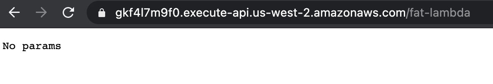

加一个请求字符串测试。

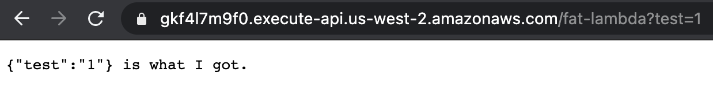

要使用路径参数需要先在路径中添加。点击 API Gateway 下的「Routes」，点击「/fat-lambda」之下的 `ANY`。

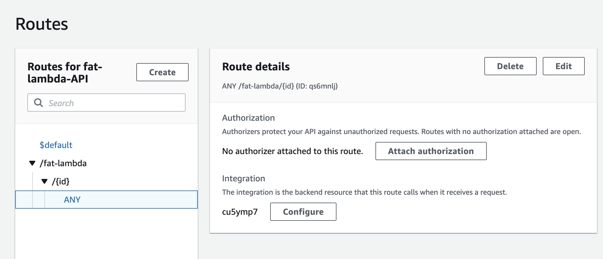

给路径添加一个参数，成 `/fat-lambda/{id}`。

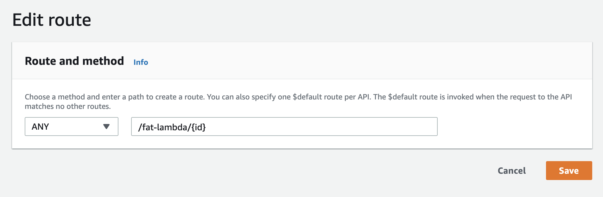

在浏览器地址末尾加入任意字符串，刷新，可见结果。

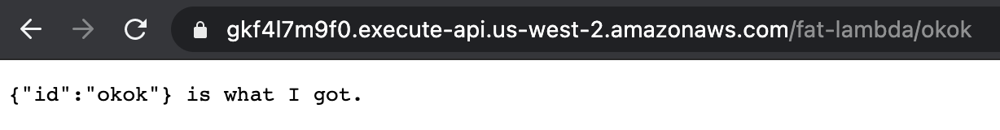

### 自由探索

你可以随意添加 API 路径和参数，然后指向我们的 Lambda 函数，并且在 Lambda 函数内做处理。


