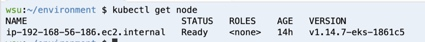

# 步骤2: 创建EKS集群

2.1 eksctl 自动创建VPC和EKS集群

打开Cloud9终端管理控制台， 使用eksctl 创建EKS集群(操作需要10-15分钟),该命令同时会创建名字为eksworkshop,版本为v1.20的EKS 集群，同时创建一个包含2个m5.large 实例的受管节点组。

 ```bash
 export CLUSTER_NAME=eksworkshop
 echo "export CLUSTER_NAME=${CLUSTER_NAME}" >> ~/.bashrc
 eksctl create cluster \
       --name $CLUSTER_NAME \
       --version 1.25 \
       --managed
 ```

2.2 eksctl 使用已经存在的VPC 创建EKS集群(可选),

需要正确创建VPC和subnet子网，还需要有公有子网和NAT网关,并且，要把公有子网的Enable auto-assign public IPv4 address 选项打开 , 另外公有子网需要打上Tag : kubernetes.io/role/elb, 私有子网需要打上Tag: kubernetes.io/role/internal-elb , [Tag文档说明](https://repost.aws/knowledge-center/eks-load-balancer-controller-subnets)

```bash
#创建集群配置文件cluster-config.yaml
#替换子网id, 
apiVersion: eksctl.io/v1alpha5
kind: ClusterConfig
metadata:
  name: eksworksop
  region: us-east-1
  version: "1.25"

vpc:
  subnets:
    private:
      us-east-2a: { id: <子网id> }
      us-east-2b: { id: <子网id> }
    public:
      us-east-2a: { id: <子网id> }
      us-east-2b: { id: <子网id> }

managedNodeGroups:
  - name: nodegroup-ng-01
    minSize: 1
    maxSize: 3
    desiredCapacity: 2
    instanceType: m5.xlarge
    labels: {role: worker}
    ssh:
      publicKeyName: <ssh keypair 名字>
    tags:
      nodegroup-role: worker
    iam:
      withAddonPolicies:
        externalDNS: true
        autoScaler: true
        certManager: true
        albIngress: true
        ebs: true
        cloudWatch: true
```

```bash
eksctl create cluster -f cluster_config.yaml
```


 

  查看EKS集群工作节点
  ```bash
   kubectl cluster-info
   kubectl get node
  ```
  

2.2 (可选)部署一个测试应用
在Cloud9创建一个nginx.yaml,内容如下

```yaml
cat << EOF >> nginx.yaml
---
apiVersion: apps/v1
kind: Deployment
metadata:
  name: nginx-deployment
  labels:
    app: nginx
spec:
  replicas: 1
  selector:
    matchLabels:
      app: nginx
  template:
    metadata:
      labels:
        app: nginx
    spec:
      containers:
      - name: nginx
        image: nginx
        ports:
        - containerPort: 80
---
apiVersion: v1
kind: Service
metadata:
  name: "service-nginx"
  annotations:
        service.beta.kubernetes.io/aws-load-balancer-type: nlb
spec:
  selector:
    app: nginx
  type: LoadBalancer
  ports:
  - protocol: TCP
    port: 80
    targetPort: 80
EOF

```

 > 部署nginx

 ```bash
#部署
kubectl apply -f nginx.yaml
kubectl get deploy
kubectl get svc

#测试
ELB=$(kubectl get svc service-nginx -o json |  jq -r '.status.loadBalancer.ingress[].hostname')
echo $ELB
curl $ELB
  
 ```

>清除
>

```bash
kubectl delete -f nginx.yaml
```


