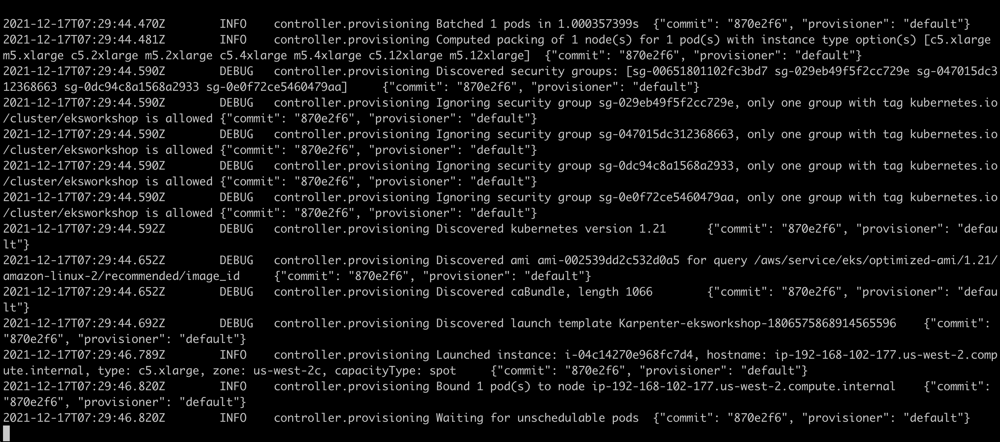
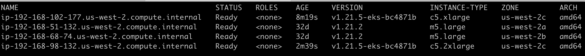
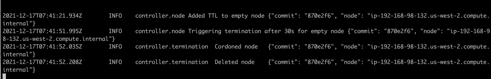

## 使用Karpenter实现EKS工作节点弹性伸缩 

 [Karpenter](https://github.com/aws/karpenter) 是AWS开源的kubernetes 工作节点弹性管理工具，它的目标是提高Kubernetes工作节点的灵活性、伸缩性以及降低成本.  

Karpenter 可以:

* 监控所有被Kubernetes scheduler标记为unschedulable的pods
* 评估Pod请求的调度请求: 资源请求(GPU/GPU),节点选择器, 亲和性, 容忍度, 拓扑
* 配置满足 Pod 要求的节点
* 调度Pods到新节点运行
* 移除空闲或者不在需要的节点

​      以AWS EKS服务为例，Karpenter 和Cluster AutoScaler 工作原理最大的区别: Cluster AutoScaler 是按照AutoScaling Group(弹性伸缩组)进行管理，通过调整Desired参数来实现节点的伸缩功能,CA并不会去计算、评估Pods的需求进行不同实例的扩展.

   Cluster AutoScaler 工作原理：


Karpenter 不使用AutoScaling Group,而是通过对Pods请求的评估直接调用EC2.*CreateFleet()*  API 就可以扩展出所需的实例

Karpenter 工作原理:     


用例: 如果当前CA管理的都是x86 AutoScaling Group ,当有一个deployment 申请arm资源后, CA不能创建出ARM节点. 而Karpenter 对Pods请求的评估后调用EC2.*CreateFleet()*  API 就可以扩展出所需的ARM实例类型.


### 创建集群

创建AWS EKS集群,初始化2个m5.large工作节点. 如果已经创建了集群可以忽略本小节

```bash
export CLUSTER_NAME=eksworkshop
export AWS_DEFAULT_REGION=us-west-2
AWS_ACCOUNT_ID=$(aws sts get-caller-identity --query Account --output text)

cat <<EOF > cluster.yaml
---
apiVersion: eksctl.io/v1alpha5
kind: ClusterConfig
metadata:
  name: ${CLUSTER_NAME}
  region: ${AWS_DEFAULT_REGION}
  version: "1.21"
managedNodeGroups:
  - instanceType: m5.large
    amiFamily: AmazonLinux2
    name: ${CLUSTER_NAME}-ng
    desiredCapacity: 2
    minSize: 1
    maxSize: 10
iam:
  withOIDC: true
EOF
eksctl create cluster -f cluster.yaml
```


 ### 1 . 准备工作

 1.1 给VPC子网打Tag

Karpenter 会自动发现含有 `kubernetes.io/cluster/$CLUSTER_NAME`标记的VPC 子网.  下面将使用AWS CLI工具对EKS集群使用的VPC子网打上对应的Tag.

  ```bash
  SUBNET_IDS=$(aws cloudformation describe-stacks \
      --stack-name eksctl-${CLUSTER_NAME}-cluster \
      --query 'Stacks[].Outputs[?OutputKey==`SubnetsPrivate`].OutputValue' \
      --output text)
  aws ec2 create-tags \
      --resources $(echo $SUBNET_IDS | tr ',' '\n') \
      --tags Key="kubernetes.io/cluster/${CLUSTER_NAME}",Value=
  ```

  1.2 创建KarpenterNode IAM 角色

   Karpenter 启动的实例必须使用 InstanceProfile 运行，该Profile授予运行容器和配置网络所需的权限。 Karpenter 会自动发现并使用`KarpenterNodeRole-${ClusterName}`的 InstanceProfile. 

  首先使用CloudFormation创建IAM资源.

   ```bash
   TEMPOUT=$(mktemp)
   curl -fsSL https://karpenter.sh/v0.5.2/getting-started/cloudformation.yaml > $TEMPOUT \
   && aws cloudformation deploy \
     --stack-name Karpenter-${CLUSTER_NAME} \
     --template-file ${TEMPOUT} \
     --capabilities CAPABILITY_NAMED_IAM \
     --parameter-overrides ClusterName=${CLUSTER_NAME}
   ```

​    其次使用以下命令将Karpenter节点role 添加到kubernetes configmap: aws-auth ,授予Profile连接EKS集群的权限.

```bash
eksctl create iamidentitymapping \
  --username system:node:{{EC2PrivateDNSName}} \
  --cluster  ${CLUSTER_NAME} \
  --arn arn:aws:iam::${AWS_ACCOUNT_ID}:role/KarpenterNodeRole-${CLUSTER_NAME} \
  --group system:bootstrappers \
  --group system:nodes
```

1.3 为karpenterController创建serviceaccount并关联对应的IAM Role

Karpenter需要特定的权限，比如EC2创建权限. 以下命令会创建对应的 AWS IAM Role, Kubernetes service account, 并且通过AWS [IRSA](https://docs.aws.amazon.com/emr/latest/EMR-on-EKS-DevelopmentGuide/setting-up-enable-IAM.html) 功能将role和IAM Role关联在一起.

```
eksctl create iamserviceaccount \
  --cluster $CLUSTER_NAME --name karpenter --namespace karpenter \
  --attach-policy-arn arn:aws:iam::$AWS_ACCOUNT_ID:policy/KarpenterControllerPolicy-$CLUSTER_NAME \
  --approve
```


### 2  使用Helm 安装Karpenter charts

2.1  使用helm 部署Karpentercharts

​    首先添加并更新karpenter的helm仓库,  使用正确的参数安装Karpenter，这里请注意我们使用eksctl创建的service account.

```bash
helm repo add karpenter https://charts.karpenter.sh
helm repo update
helm upgrade --install karpenter karpenter/karpenter --namespace karpenter \
  --create-namespace --set serviceAccount.create=false --version 0.5.2 \
  --set controller.clusterName=${CLUSTER_NAME} \
  --set controller.clusterEndpoint=$(aws eks describe-cluster --name ${CLUSTER_NAME} --query "cluster.endpoint" --output json) \
  --wait # for the defaulting webhook to install before creating a Provisioner
```

启用调试日志 (可选)

```sh
kubectl patch configmap config-logging -n karpenter --patch '{"data":{"loglevel.controller":"debug"}}'
```

2.2 设置Provisioner

单个 Karpenter provisioner 可以处理许多不同的pod 资源请求. Karpenter 根据标签和关联性等pod属性做出调度和配置. Karpenter 消除了管理许多不同节点组的需求.

使用以下命令创建默认的provisioner. 使用`ttlSecondsAfterEmpty` 参数可以配置节点空闲时间,TTL达到之后Karpenter会终止该工作节点. 可以将该参数设置为-1或者undefined来禁止终止行为.

可以访问[provisioner CRD](https://karpenter.sh/docs/provisioner/) 得到更多的provisioner 配置信息. 例如, `ttlSecondsUntilExpired` 可以设置Karpenter 在过期时间到达后终止该节点.

```bash
cat <<EOF | kubectl apply -f -
apiVersion: karpenter.sh/v1alpha5
kind: Provisioner
metadata:
  name: default
spec:
  requirements:
    - key: karpenter.sh/capacity-type
      operator: In
      values: ["spot"]
    - key: node.kubernetes.io/instance-type
      operator: In
      values: ["m5.xlarge", "m5.2xlarge","m5.4xlarge","m5.12xlarge","c5.xlarge","c5.2xlarge","c5.4xlarge","c5.12xlarge"]
  limits:
    resources:
      cpu: 1000
  provider:
    instanceProfile: KarpenterNodeInstanceProfile-${CLUSTER_NAME}
  ttlSecondsAfterEmpty: 30
EOF
```


## 3 测试

3.1 部署测试应用,默认副本数为0

```bash
cat <<EOF | kubectl apply -f -
apiVersion: apps/v1
kind: Deployment
metadata:
  name: inflate
spec:
  replicas: 0
  selector:
    matchLabels:
      app: inflate
  template:
    metadata:
      labels:
        app: inflate
      annotations:
        appmesh.k8s.aws/sidecarInjectorWebhook: disabled
    spec:
      terminationGracePeriodSeconds: 0
      containers:
        - name: inflate
          image: public.ecr.aws/eks-distro/kubernetes/pause:3.2
          resources:
            requests:
              cpu: 1
EOF
```

3.2 开启多个终端窗口使用watch进行观察节点和pod

```bash
watch -t -n 1 kubectl get node -Lnode.kubernetes.io/instance-type -Ltopology.kubernetes.io/zone -Lkubernetes.io/arch

```

```bash

watch -t -n 1 kubectl get pod
```


3.3 伸缩测试

> 通过kubectl scale 增加inflate副本数量,触发karpenter,并观察karpenter controller日志和kubectl node

```bash
kubectl scale deployment inflate --replicas 1
```




> 将副本增加到10

 ```bash
 kubectl scale deployment inflate --replicas 10
 ```


Karpenter 会计算unschedulable的Pods然后扩展EC2，这里看见拉起的就是c5.2xlarge



> 收缩测试，当节点空闲时Karpenter controller向该节点发出TTL标志（ controller.node  Added TTL to empty node）时间到了就会终止该EC2节点

```bash
 kubectl scale deployment inflate --replicas 0
```


