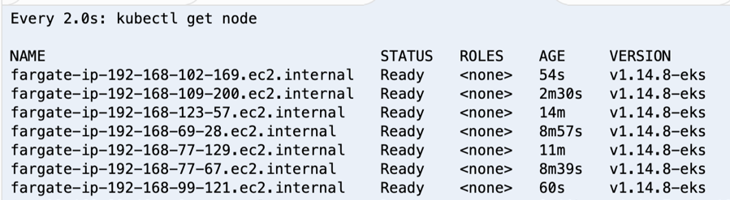

#  步骤4: 部署示例应用，通过HPA测试Fargate弹性伸缩功能
我们将要部署Metrics Server,部署标准HPA实例程序hpa-example ，并通过Horizontal Pod Autoscaler (HPA)设置CPU 50%自动扩展策略,测试Fargate弹性伸缩功能。 

**本节所有操作均部署在namespace dev*

4.1 安装Metrics Server 0.3.6 , Metrics Server会提供性能检测配合HPA实现Fargate水平扩展。

请在Cloud9环境的终端上运行以下命令安装Metrics Server
```bash
curl -Ls https://api.github.com/repos/kubernetes-sigs/metrics-server/tarball/v0.3.6  -o metrics-server-v0.3.6.tar.gz
mkdir metrics-server-v0.3.6
tar -xzf metrics-server-v0.3.6.tar.gz --directory metrics-server-v0.3.6 --strip-components 1

kubectl apply -f metrics-server-v0.3.6/deploy/1.8+/

kubectl get deployment metrics-server -n kube-system

```
> 验证metrics-server是否成功

```bash
kubectl get apiservice v1beta1.metrics.k8s.io -o yaml
```

> 如果返回结果如下(message: all checks passe)，则metrics server安装成功


4.2 部署实例应用 php-apache,并设置HPA cpu 50%开始自动扩展,最大扩展10个replicas

```bash
#部署HPA示例应用
kubectl run php-apache --image=k8s.gcr.io/hpa-example --requests=cpu=200m --expose --port=80 --namespace dev

#设置CPU50%进行扩展,最大扩展为10个副本
kubectl autoscale deployment php-apache --cpu-percent=50 --min=1 --max=10 --namespace dev
```

> 在Cloud9环境中新开一个终端,启动压力客户端。通过脚本访问php-apache服务，持续增加压力。

```bash
#启动压力客户端
kubectl run -i --tty load-generator --image=busybox /bin/sh --namespace dev
#运行压力脚本 
while true; do wget -q -O - http://php-apache; done
``` 
如下图所示


4.3 观察fargate弹性伸缩变化
我们启动一个新的终端来启动观察HPA变化,Fargate实例变化,通过“watch kubectl get hpa --namespace dev “ 我们可以持续的观察CPU压力，以及对应的Replicas数量, 同时我们也可以观察Fargate工作实例数量。

```bash
#观察HPA变化
watch kubectl get hpa -n dev
```

> 会看到类似下图HPA的变化（CPU使用率，副本数都在增加)


> 查看当前fargate节点是否根据自动扩展。

```bash
#观察fargate实例数
watch kubectl get nodes
```

> Fargate 实例会自动根据HPA的策略，副本数增加而自动扩展





